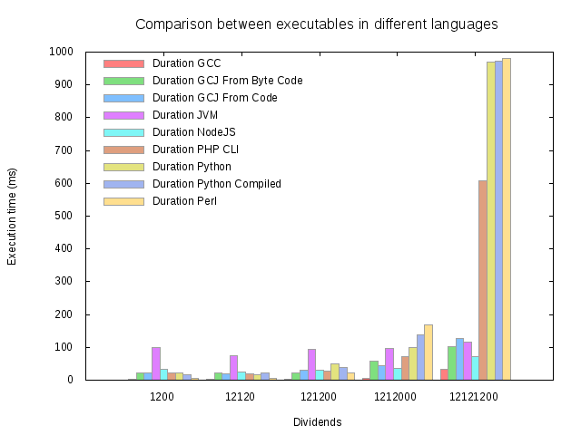

## JVM, GCJ, GCC performance

### Which performs better in finding all factors of an integer number?

Edit and execute `compare.sh` in a bash environment. For example, it can:

-	generate
	- the Java byte code (with javac),
	- an ELF binary from the .java code (with gcj-4.9),
	- an ELF binary from the .class byte code (with gcj-4.9),
	- an ELF binary from the .c code (with gcc-4.9);
-	run some tests using as dividends
	- some powers of ten (one per OdM),
	- some numbers with a lot of factors (one per OdM),
	- some prime numbers (one per OdM);
-	output the results in CSV format.

The output can be used to generate an histogram with GNUplot.

Basic usage:

```
user@linuxbox$ ./compare.sh 
```

Or just:

```
user@linuxbox$ ./compare.sh --task=just_build
user@linuxbox$ ./compare.sh --task=just_run
```

Complete usage:

```
user@linuxbox$ ./compare.sh > results.csv && gnuplot plot.gp # histogram.png
```

### Results

In my Linux box, with this algorithm and no further investigation, it seems that:
-	C has always the best performaces, expecially for small tasks;
-	NodeJS is always fine;
-	JVM is a bit slower than Node;
-	PHP and Python are far slower on big tasks, but quicker on small tasks (only after C).

Besides:
-	the compiled Java is better than JVM on small tasks e worst on big tasks;
-	it makes no significant difference compiling Java from the Java code or from the byte code;
-	it makes no significant difference using inpterpreted Python or its byte code;
-	it makes no significant difference using PHP as CLI command or as Apache HTTPD module.

(Linux 3.16.0-4-amd64, OpenJDK 1.7, gcc-4.9, gcj-4.9, NodeJS v0.10.26, PHP 5.6.2-1, Python 2.7.8)



